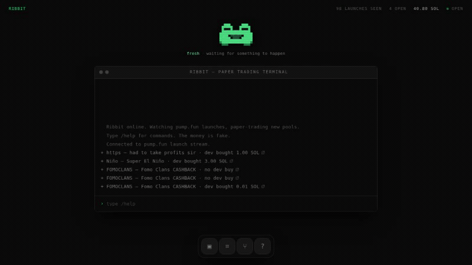

<div align="center">

# 🐸 Ribbit

**A frog watches Solana token launches and paper-trades them.**

Real launches. Real prices. Simulated trades.

[](https://www.typescriptlang.org/)
[](https://react.dev/)
[](https://vite.dev/)
[](https://tailwindcss.com/)
[](https://motion.dev/)
[](https://zustand.docs.pmnd.rs/)
[](https://vitest.dev/)

[](https://solana.com/)
[](https://pump.fun/)
[](https://www.geckoterminal.com/)




</div>

## What it is

Ribbit is a terminal that sits in your browser watching new tokens appear on Solana in real time, runs three fixed strategies against the pools they create, and narrates the whole thing through an animated pixel frog who is visibly pleased or upset depending on how it is going.

## How it works

```
browser tab
  ├─ ws   pumpportal.fun          live token launches → terminal feed, frog reactions
  ├─ http api.geckoterminal.com   new_pools → strategy entries
  │                               ohlcv     → position settlement
  └─ localStorage                 session history
```

Two data sources, and the split is deliberate:

- The **websocket** provides liveness. Roughly 26 tokens are created per minute on pump.fun, so something is always happening on screen.
- The **polled REST endpoint** provides prices. Freshly launched tokens are not indexed by any free price API for a while, so they cannot be priced at the moment they appear - which is exactly why entries are driven by newly created *pools*, which arrive with a price already attached.

Neither source can do the other's job.

### Positions settle from history, not from a watcher

Nothing polls a position waiting for it to hit a stop. Instead each position stores its entry price and timestamp, and when it is resolved the engine fetches one-minute candles from the entry point forward and walks them: the first candle whose low crosses the stop, or whose high crosses the target, is the exit.

This is more accurate than a polling bot would be, because a poll can miss a wick entirely. It is also a pure function of `(candles, position)` - no clock, no network, no framework - which is why `src/sim/` is where the tests live.

The same pass produces the **live market cap and unrealized P&L** on open positions for free: the candles it already downloaded end at the current price, so marking a position costs no additional request. A row the pass has not reached yet shows `-` rather than a stale number.

When a single candle touches both the stop and the target, the stop wins. A one-minute candle records no ordering within itself, so the outcome is genuinely unknown, and resolving the ambiguity against the position is what keeps reported results from drifting optimistic.

## The strategies

**One strategy trades at a time**, and they rotate every four minutes, sharing a single 50 SOL balance and staking 2 SOL per position. They exit identically - 2× target, −30% stop, 60-minute cap - so the only thing that differs between them is the entry rule, and the comparison measures entry timing and nothing else.

| Strategy | Entry rule |
| --- | --- |
| **FRESH** | Buys the moment a pool appears. No filter, no patience. |
| **DIP** | Waits for a 20% drawdown from first sight, then buys. |
| **MOMENTUM** | Buys only when the pool clears 40 trades in five minutes. |

This is a proof-of-concept: three strategy implementations driven by real-time data, rendered through a dynamic interface. The project is the engine and the interface, not the edge.

## Honest limits

- **Every trade is simulated.** No wallet, no capital, no live trading, and none is planned.
- Token names and symbols are rendered exactly as the launch feed sends them. That feed is unmoderated, so some of them are offensive.
- Entry prices come from an API polled once a minute. A real bot would fill differently, and worse.
- The public price API allows roughly 30 requests per minute, so requests are serialized through a single queue and entries are capped per scan. Over that ceiling the API answers `429` - and because that response carries no CORS headers, the browser rejects it as a network failure and the status code is never readable. A rate limit is therefore indistinguishable from any other fetch failure at this layer, which is why one is assumed and the queue backs off for 90 seconds.
- The launch feed shows the creator's own opening buy rather than market cap. Every pump.fun token starts near 28 SOL from the bonding curve's initial reserves, so market cap is the same number on almost every line; the opening buy ranges from nothing to tens of SOL and actually distinguishes launches.
- Session history lives in `localStorage`. Clearing it resets the record.

## Commands

`/help` · `/status` · `/positions` · `/history` · `/strategies` · `/reset`

Tab completes, arrow keys walk history. The dock at the bottom opens draggable panels.

## Ribbit himself

Six moods - idle, watching, excited, happy, sad, sleeping - driven by what the engine is doing.

He is drawn as a character grid, one character per pixel, rendered as divs. There are no image assets and no sprite sheets; to redraw the frog, edit the strings in `src/mascot/frames.ts`.

## Local development

```bash
npm install
npm run dev
npm test
npm run lint
npm run format
npm run build
```

## Licence

MIT
